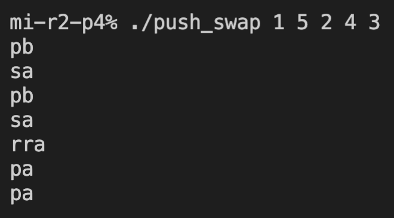
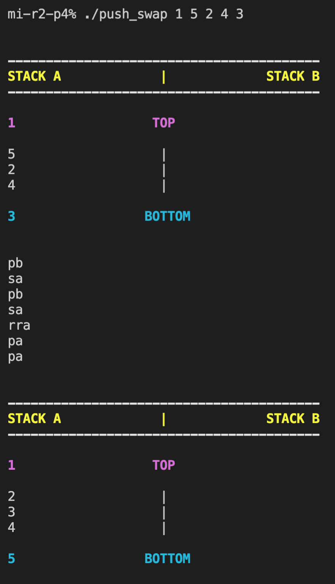
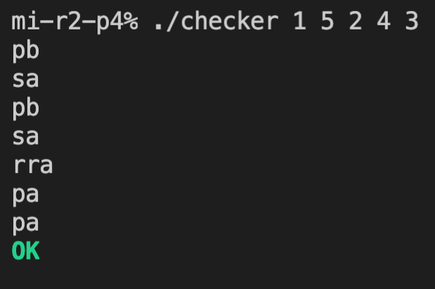
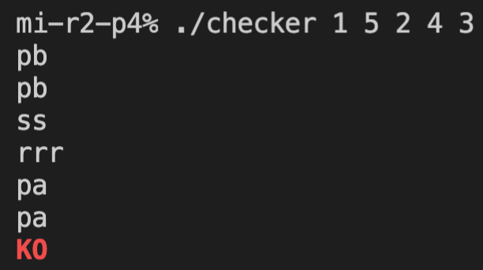
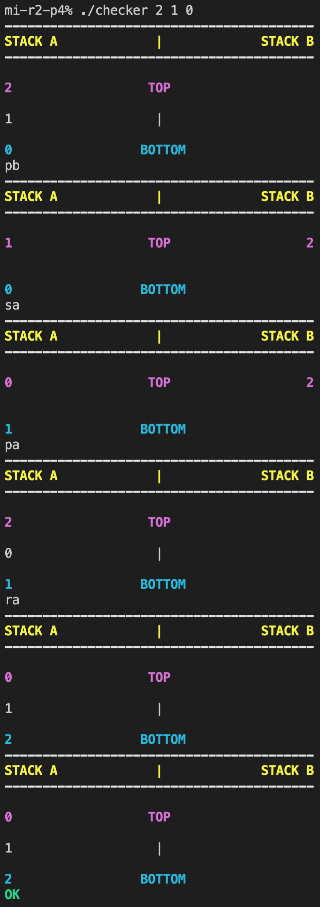
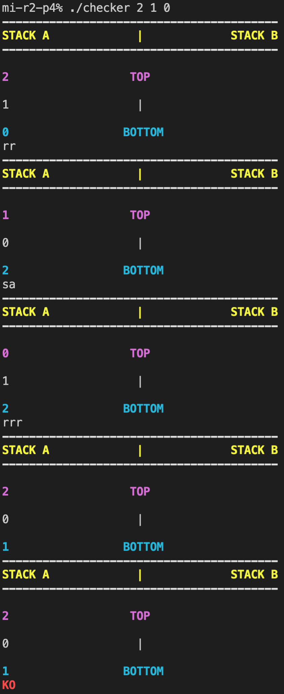

# push_swap

## Push_swap is a project about efficiently sorting a list of numbers by using two stacks.

### It is composed of two parts:
- #### 📶 "push_swap" executable will accept the numbers as arguments and will display the necessary commands to sort them.
- #### ✅ "checker" executable will accept the numbers as argments, wait for user's input commands and apply them to the stack of numbers. When stopped it will display "OK" if the stack is sorted or "KO" if it's not.

## "push_swap" executable examples:
- #### Standard behaviour as required per subject:

- #### Detailed version of the status of the stack at the start and at the end of execution of push_swap:

## "checker" executable examples:
- #### Standard behaviour as required per subject:

- #### Detailed version of the status of the stacks after every instruction:

